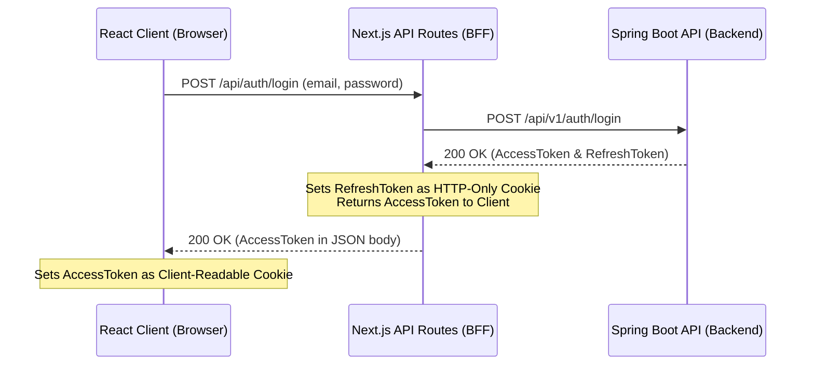

# Developer Guide: Authentication & TanStack Query in Attend

This guide explains how authentication is structured and how **TanStack Query** (React Query) is used in the Attend web applications (`attend-admin`, `attend-partners`, and `attend-web`). 

---

## 1. Authentication Architecture Overview

The authentication system is split into three main layers:
1. **Next.js Frontend (Client)**: React components, state, and browser cookies.
2. **Next.js BFF (Backend for Frontend / API Routes)**: Proxy routes located in `src/app/api/auth/*` that handle secure HTTP-Only cookie management.
3. **Java Spring Boot API (Backend)**: The core authentication and business logic server.



---

## 2. The Token Strategy (Access vs. Refresh Tokens)

We use two types of JWT tokens to secure requests:

| Token | Stored In | Client Readable? | Purpose |
| :--- | :--- | :--- | :--- |
| **`accessToken`** | Standard Client Cookie (`accessToken`) | **Yes** | Attaches to every outbound API request in the `Authorization: Bearer <token>` header. Short-lived. |
| **`refreshToken`** | HTTP-Only Cookie (`refreshToken`) | **No** (Secure) | Used to request a new `accessToken` when the current one expires. Long-lived. |

### Why use an HTTP-Only cookie for the Refresh Token?
This prevents cross-site scripting (XSS) attacks from stealing the refresh token. Since JavaScript cannot read HTTP-Only cookies, attackers cannot hijack the session permanently.

---

## 3. How Login Works Under the Hood

### Step 1: Client Submits Form
When the user submits the login form in [login/page.tsx](file:///home/rojitech/Desktop/CODEC/SCHULLTECH/MERISTEM/attend-admin/src/app/login/page.tsx), it calls the `loginMutation`:
```typescript
loginMutation({ email, password });
```

### Step 2: Next.js BFF Intercepts & Sets Cookies
The request is sent to the local Next.js proxy route [app/api/auth/login/route.ts](file:///home/rojitech/Desktop/CODEC/SCHULLTECH/MERISTEM/attend-admin/src/app/api/auth/login/route.ts). The proxy performs the following:
1. Calls the backend Spring Boot login API.
2. Extracts the `refreshToken` and sets it as an HTTP-Only cookie.
3. Removes the `refreshToken` from the response body and forwards the remaining user data and `accessToken` to the client.

### Step 3: Client Sets Client-Readable Cookie & Redirects
In [auth/hooks.ts](file:///home/rojitech/Desktop/CODEC/SCHULLTECH/MERISTEM/attend-admin/src/api/auth/hooks.ts), the `onSuccess` callback of the hook handles the final step:
```typescript
onSuccess: (response) => {
  const token = response.data.token;
  if (token) {
    // Save accessToken for client-side API requests
    Cookies.set("accessToken", token, {
      secure: process.env.NODE_ENV === "production",
      sameSite: "strict",
    });
  }
}
```

---

## 4. Next.js Routing and Protection (`proxy.ts`)

Next.js automatically runs any file named [src/proxy.ts](file:///home/rojitech/Desktop/CODEC/SCHULLTECH/MERISTEM/attend-admin/src/proxy.ts) as routing middleware. This file protects routes by checking for the presence of the `accessToken` cookie.

```typescript
export function proxy(request: NextRequest) {
  const { pathname } = request.nextUrl;
  const isPublicRoute = publicRoutes.some((route) => pathname.startsWith(route));
  
  // Verify token presence
  const hasToken = !!request.cookies.get("accessToken");

  // Redirect to login if user attempts to access a protected route without a token
  if (!isPublicRoute && !hasToken) {
    const loginUrl = new URL("/login", request.url);
    loginUrl.searchParams.set("callbackUrl", pathname);
    return NextResponse.redirect(loginUrl);
  }

  // Redirect to dashboard if authenticated user tries to access /login
  if (isPublicRoute && hasToken && pathname === "/login") {
    return NextResponse.redirect(new URL("/", request.url));
  }

  return NextResponse.next();
}
```

---

## 5. Axios Client Interceptors (Auto-Refresh)

The Axios instance [lib/api-client.ts](file:///home/rojitech/Desktop/CODEC/SCHULLTECH/MERISTEM/attend-admin/src/lib/api-client.ts) is configured with two interceptors:

### 1. Request Interceptor (Inject Token)
Adds the `Authorization` header automatically to all non-public requests:
```typescript
apiClient.interceptors.request.use((config) => {
  const token = Cookies.get("accessToken");
  if (token && config.headers) {
    config.headers["Authorization"] = `Bearer ${token}`;
  }
  return config;
});
```

### 2. Response Interceptor (Handle Token Expiry)
If a request fails with `401 Unauthorized`, it attempts to silently renew the `accessToken` using the HTTP-Only `refreshToken` and retry the failed request:
1. Hits `/api/auth/refresh` (BFF route, which forwards the HTTP-Only cookie).
2. Sets the new `accessToken` in the cookies.
3. Retries the original request.
4. If refresh fails, it clears the cookies and redirects to `/login`.

---

## 6. How TanStack Query (React Query) is Used

TanStack Query handles client-side caching, loading states, error states, and automatic data synchronisation. We structure this using custom hooks:

### A. Fetching Data with `useQuery`
We use `useQuery` to fetch and cache data. For example, `useGetMe` in [auth/hooks.ts](file:///home/rojitech/Desktop/CODEC/SCHULLTECH/MERISTEM/attend-admin/src/api/auth/hooks.ts):
```typescript
export const useGetMe = () => {
  return useQuery({
    queryKey: authKeys.me(),
    queryFn: authClient.getMe,
    // Only execute the query if an accessToken exists
    enabled: !!Cookies.get("accessToken"),
    retry: false,
  });
};
```
- **`queryKey`**: The unique identifier for this cache. If other components call `useGetMe`, they will read from the same cache instantly instead of sending multiple API requests.
- **`enabled`**: Prevents the query from executing automatically if there is no token.

### B. Performing Actions with `useMutation`
We use `useMutation` for actions that create, update, delete, or perform write operations (like Login/Logout/Create Event).
Example of `useLogin`:
```typescript
export const useLogin = () => {
  const queryClient = useQueryClient();

  return useMutation({
    mutationFn: authClient.login,
    onSuccess: (response) => {
      // 1. Save access token
      const token = response.data.token;
      if (token) Cookies.set("accessToken", token);

      // 2. Invalidate existing user cache (forces a refetch of getMe with new user details)
      queryClient.invalidateQueries({ queryKey: authKeys.me() });
    },
  });
};
```
- **`mutationFn`**: The asynchronous function performing the request.
- **`queryClient.invalidateQueries`**: Tells TanStack Query that the cached user data is out-of-date. It automatically triggers a background refetch for components that are active and using `useGetMe()`.

---

## Summary for Devs: Key Takeaways
1. **Never make backend calls directly** for login/logout; always use the local Next.js proxy route BFF to ensure HTTP-Only cookies are managed correctly.
2. **Never access protected resources manually**; use the `apiClient` instance because it automatically injects `Bearer <token>` headers.
3. **Use `useQuery`** for reading data (gets cached, auto-updates).
4. **Use `useMutation`** for writing data / triggering side effects (like sending a POST/PUT request). Always remember to **invalidate queries** in `onSuccess` if the mutation changes existing data!
